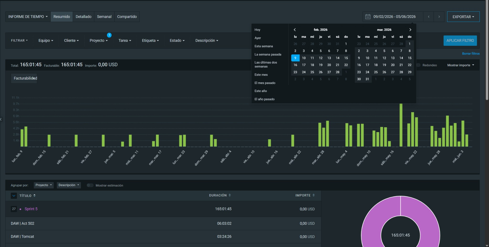
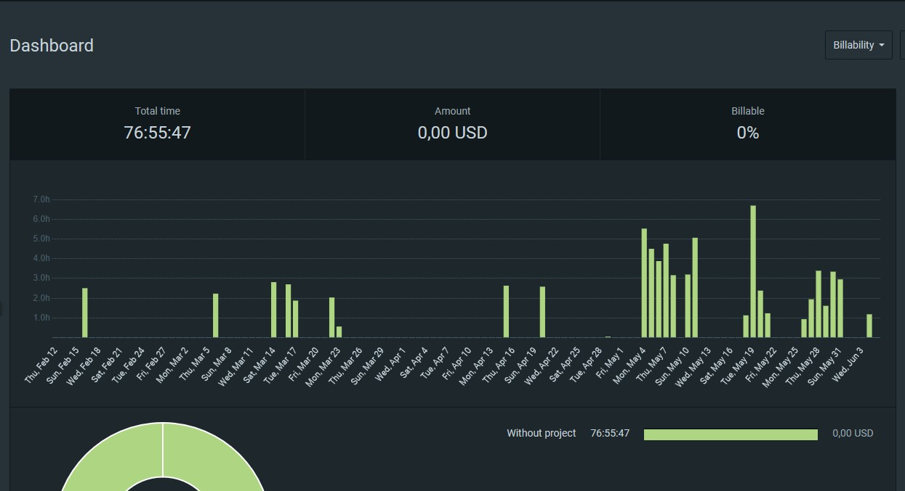
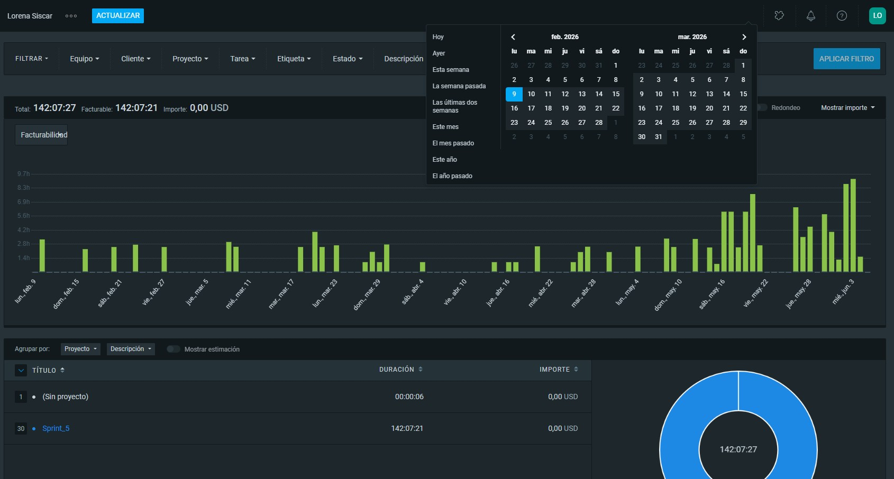
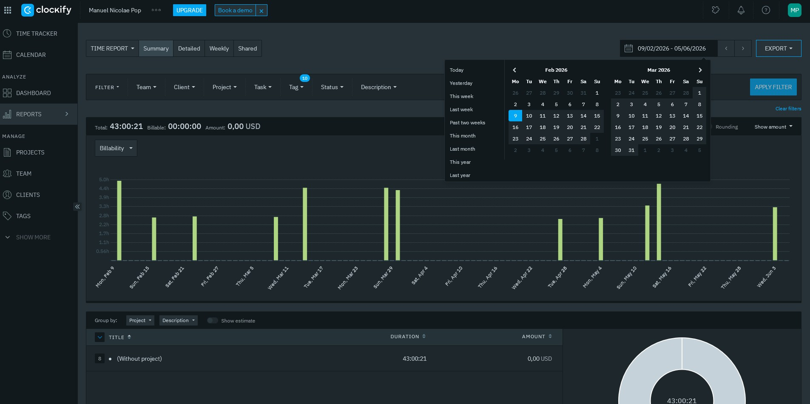

# IV. Altres

## IV.1. Problemes generals trobats i les seues solucions

Durant el desenvolupament, ens vam adonar que diverses coses necessitaven ser corregides perquè la web funcionara bé i es vera uniforme. Estos són els reptes principals i com els arreglem:

### IV.1.a. Resolució de dubtes durant el desenvolupament del projecte

#### El Problema
Durant este projecte final, vam tindre alguns dubtes i, en determinats moments, no teníem clar quina era la millor opció per a continuar avançant. Vam contactar amb el professor per correu electrònic, però, tenint en compte la situació de la vaga, enteníem que les respostes podien tardar o no tindre una resposta.

#### La Solució
Buscant per internet i preguntant a la IA varem tindre la solució.

### IV.1.b. Coordinació del treball en equip

#### El Problema
L'organització del treball va presentar algunes dificultats, ja que cada membre del grup va finalitzar les seues pràctiques externes en dates diferents. Això va complicar la coordinació de reunions i la distribució equilibrada de les tasques.

#### La Solució
Per a superar este inconvenient, vam mantindre una comunicació constant a través de ferramentes digitals i vam planificar les tasques segons la disponibilitat de cada integrant. D'esta manera, vam poder coordinar-nos adequadament i complir els terminis establits.

### IV.1.c. Acumulació d'exàmens a causa de la vaga

#### El Problema
La vaga està provocant una reorganització del calendari acadèmic, comportant una acumulació d'exàmens i treballs en un període de temps reduït. Esta situació està dificultant la dedicació contínua al projecte i als exàmens.

#### La Solució
Vam establir una planificació més estricta del temps disponible, prioritzant les tasques més importants i repartint la càrrega de treball entre els membres del grup.

---

## IV.2. Hores totals en el Clockify

| Assignatures    | Hores estimades | Miguel  | Efren  | Lorena | Manuel |
|-----------------|-----------------|---------|--------|--------|--------|
| DWEC            | 52h             | 4,25h   | 14h    | 18,5h  | 10h    |
| PI              | 12h             | 54,75h  | 38h    | 11,5h  | 3,5h   |
| DAW             | xxh             | 9,5h    | 8,5h   | 0h     | 8h     |
| DIW             | 39,5h           | 39,75h  | 23,5h  | 33h    | 18,5h  |
| Altres          | xxh             | 56,75h  | 24h    | 57,5h  | 40,75h |
| **Total/persona** | **xxh**       | **165h** | **108h** | **142h** | **80,75h** |
| **Total**       |                 |         |        |        | **496h** |

Algunes de les desviacions detectades es deuen a activitats que han requerit més dedicació de l'esperada, com per exemple adaptar la API per a què es comunique amb APIWOO. Cada un d'estos elements ha suposat un esforç addicional que no estava previst de forma tan exhaustiva en el plantejament inicial. També ha influït molt que alguns de nosaltres vam tornar de pràctiques en moments diferents, que un membre de l'equip té diverses assignatures convalidades i per la vaga.

### Clockify Miguel

### Clockify Efren

### Clockify Lorena

### Clockify Manuel

---