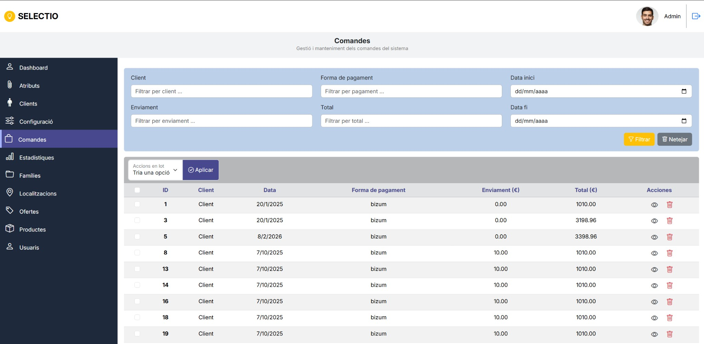
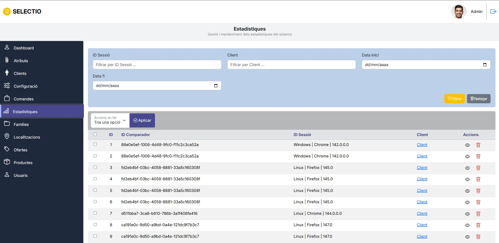
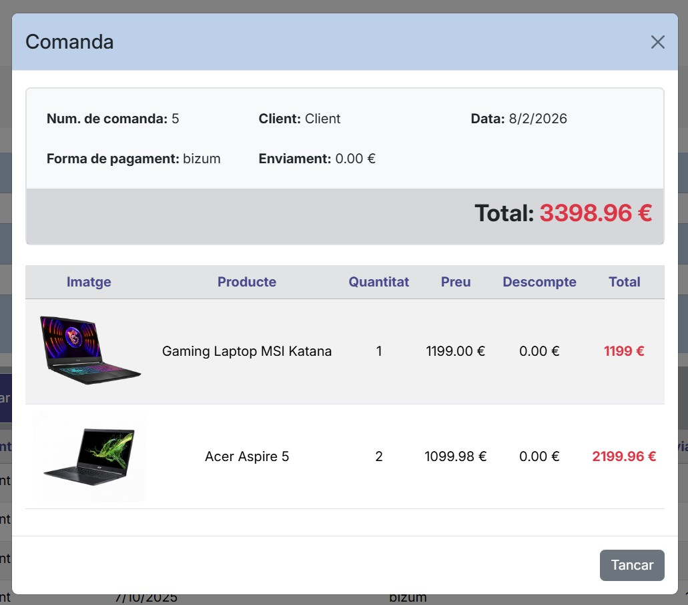

# III. Desenvolupament WEB en entorn Client

## III.1. Ús de React al projecte

L'ús de React ens ha permés expandir les funcionalitats del projecte, implementant el DOM Virtual de React, una sessió d'usuari persistent mitjançant un Context tant per a frontend com a backend, i hem implementat algunes configuracions del comparador, com per exemple la font de les dades sobre productes/clients etc.

A més, hem implementat la gestió de comandes de la tenda fake, com es veu a la imatge. La gestió de localitzacions d'on la tenda pot rebre comandes, la colecta i lectura d'estadístiques sobre els usuaris del comparador.

!!! info "Funcionalitats implementades amb React"
    - DOM Virtual de React
    - Sessió d'usuari persistent via Context (frontend i backend)
    - Configuració del comparador (font de dades, productes/clients, etc.)
    - Gestió de comandes de la tenda fake
    - Gestió de localitzacions
    - Col·lecta i lectura d'estadístiques d'usuaris

### Panell de gestió de comandes

El back-office implementat amb React permet filtrar i gestionar les comandes per client, forma de pagament, enviament, total i dates. Cada comanda es pot visualitzar o eliminar des de la taula principal.

### Panell d'estadístiques

La secció d'estadístiques permet fer seguiment de les sessions per comparador, identificant el client, el sistema operatiu i el navegador utilitzat.

---

## III.2. Configuració de l'API amb APIWOO

Com a part de la gestió de la configuració hem implementat una API en PHP que es connecta a la API REST d'una instància de WooCommerce per sincronitzar dades amb un JSON local, fet que hem aconseguit realitzant un **mapeig** dels camps retornats per WooCommerce als camps de la BD nostra existent. Aquesta funcionalitat es gestiona des del BO implementat amb React.

!!! warning "Problema de connectivitat a classe"
    Vam tindre problemes per connectar-nos a la base de dades a classe degut al router de Conselleria que no ens va permetre accedir a la seua IP, fet que ens va ralentitzar el desenvolupament.

### Detall d'una comanda

Cada comanda mostra la informació del client, data, forma de pagament, enviament i total, juntament amb el detall de cada producte inclòs.

